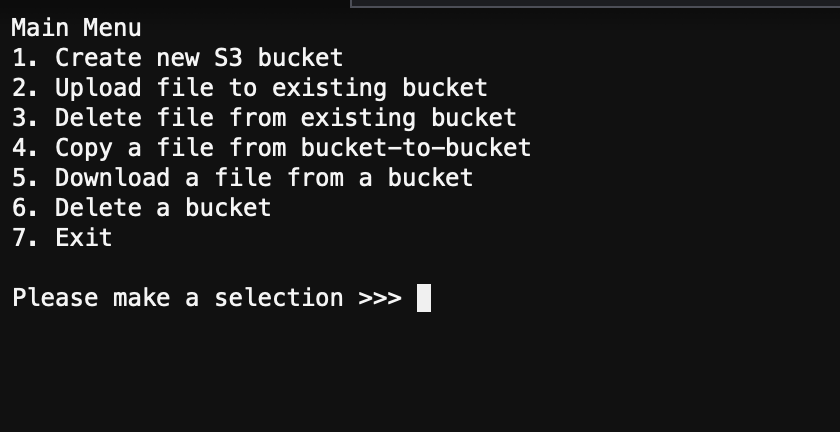

# Introduction
This assignment demonstrates the successful creation and use of Amazon S3 buckets using a Python command line menu-driven interface application developed using the Cloud9 programming interface.

## Python CLI Menu-Driven Application
The assignment required the creation of a CLI menu-driven application with Python and the AWS Cloud9 IDE. The application provides the following functionality:

1.	Create a S3 bucket with a name consisting of first name, last name, and a random 6-digit suffix (e.g., jonathan-mainhart-123456).
2.	Put an object in a previously created bucket
3.	Delete an object in a bucket
4.	Delete a bucket
5.	Copy an object from one bucket to another
6.	Download an existing object from a bucket
7.	List the date and time upon exiting

The application consists of three Python modules and uses code samples provided by Amazon. The code is annotated when a sample is used.

## Operation
The application allows users to perform a limited number of tasks with S3 via a menu-driven command-line interface.

### Main Menu
The Main Menu shown in figure 1 below features seven functions and allows users to navigate the application by entering the number associated with their selection. Each selection executes the associated function which may present the user with additional choices or prompt the user for input depending on the specific function called. 

1. Create New S3 Bucket
   This menu item will generate a new S3 bucket. The name is generated by appending a random 6-digit number to the end of the string “jonathan-mainhart-”. The name is checked against the list of existing buckets to ensure no other bucket exists with the exact name before the bucket is created. The user is alerted to try again in the unlikely event that the same name is found, otherwise the bucket is created.
2. Upload File to Existing Bucket
   This menu item allows a user to enter the name of a file that exists in the local file system and upload it to an existing bucket. If the file name is valid, a list of available buckets is presented to the user to select as a destination. The user is returned to the main menu if there are no buckets available. If the destination name is valid, the file is uploaded. 
3. Delete a File from an Existing Bucket
   This menu item allows a user to permanently delete a file from an existing bucket. The user is presented with a list of available buckets from which to choose from. The user is alerted if no buckets are available and returned to the main menu. The user is presented with a list of available files in the selected bucket and again returned to the main menu if none are available. The user will be alerted if they make an error entering the bucket or file name. The file is deleted once the bucket and file names are verified.
4. Copy a File from Bucket to Bucket 
   This menu item allows a user to copy a file from one bucket to another. The user is returned to the main menu if there are no buckets available or if the selected source bucket does not contain any files. The user will be presented with a list of available buckets and prompted to enter the source and destination bucket names. The user is then presented with a list of available files in the source bucket if both bucket names are valid. If the user enters a valid file name, the file will be copied from the source bucket to the destination bucket.
5. Download a File from a Bucket
   This menu item allows the user to download a file from an S3 bucket. The user is returned to the main menu if no buckets are available or the selected bucket is empty. The user will be presented with a list of available buckets and prompted to enter the source bucket name. The user will then be presented with a list of available files if the bucket name is valid. If the user enters a valid file name, the file will be downloaded.
6. Delete a Bucket
   This menu item allows a user to delete an existing bucket. The user is returned to the main menu if no buckets are available to delete. The user will be presented with a list of available buckets and prompted to enter the desired bucket name. If the bucket name is valid, the bucket will be checked for files. If files are present, the user will be presented with a list of file names and prompted to confirm deletion. If confirmed, the files are deleted. Once the bucket is empty, the user is prompted to confirm deletion of the bucket. If confirmed, the bucket is deleted. The process is aborted if the user does not explicitly confirm file or bucket deletion.
7. Exit
   This menu item exits the program. Upon exit, the user is presented with the current date and UTC time.

## Application in Action

